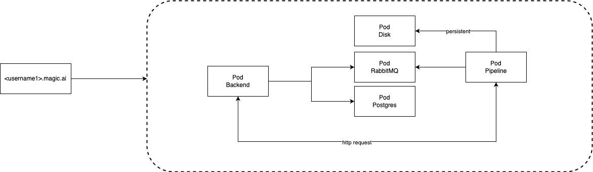

# magicbean-mothership


env setup:

```
minikube start
```

start:

```
kubectl apply -f .         
```
 
stop:

```
kubectl delete -f .
```

logs:

```
kubectl get pods
kubectl logs --tail=-1 backend-595c68f6d-t57rs 
```

inspect:

```
kubectl exec -it ngx-pod -- sh
kubectl describe pod backend-595c68f6d-fr9kx 
```

service:

```
kubectl get svc  
```

scale:

```
kubectl scale --replicas=5 deploy ngx-dep
```


pvc:

```
kubectl get pv 
kubectl delete pv pvc-941777a1-b6e4-4cbf-b7ca-56e60d423f2c
```


